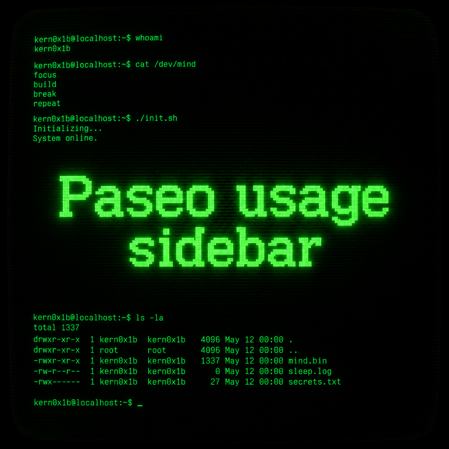
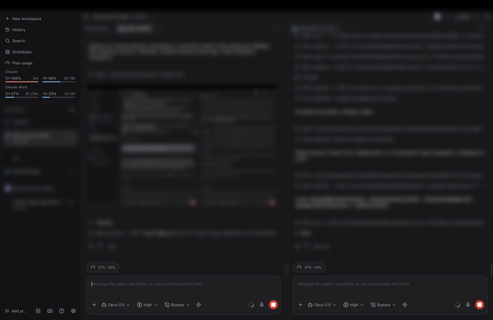

<p align="center">
  
</p>

# Paseo Usage Sidebar — multi-account fork

A fork of [RUIIIOVO/paseo-usage-sidebar](https://github.com/RUIIIOVO/paseo-usage-sidebar) for people
who run more than one Claude account in [Paseo](https://paseo.sh).

Paseo reports plan usage for one Claude login only: `~/.claude`, or the default Keychain item. A
custom provider that `extends: "claude"` with its own `CLAUDE_CONFIG_DIR` gets no usage at all,
neither in **Settings → Usage** nor in the composer's context tooltip. This fork reads those
accounts itself and shows them everywhere the plugin draws.



## What the fork adds

### Extra Claude accounts

Every enabled provider in `~/.paseo/config.json` that extends `claude` and sets its own
`CLAUDE_CONFIG_DIR` becomes a usage card of its own, placed right after the default Claude card.

```json
"agents": {
  "providers": {
    "claude-work": {
      "extends": "claude",
      "label": "Claude Work",
      "env": { "CLAUDE_CONFIG_DIR": "/Users/you/.claude-work" },
      "enabled": true
    }
  }
}
```

- The token comes from `<CLAUDE_CONFIG_DIR>/.credentials.json`. On macOS, if that file is missing,
  it comes from the Keychain item `Claude Code-credentials-<first 8 hex of sha256(CLAUDE_CONFIG_DIR)>`,
  the name Claude Code itself uses.
- Credentials are only read, never refreshed; the Claude CLI owns refresh, same as in the daemon.
  An expired token shows the account as unavailable until the CLI renews it.
- Windows, ids and tones match the daemon's own Claude card, so pins work the same way.
- Cached for 5 minutes, like the daemon's usage cache. `config.json` is re-read on every poll, so
  a new provider shows up without a plugin reload.
- A failing account becomes an error card; it never hides the daemon's providers.

### Antigravity

With the `antigravity-cli` plugin enabled, Antigravity gets a card too: a 5-hour and a weekly window
for each model group it reports (Gemini; Claude and GPT), read from the same quota call `agy /usage`
makes. The token is the one `agy` keeps in the macOS Keychain (`gemini` / `antigravity`), read only;
`agy` refreshes it. Not available on other platforms.

### Composer pill

Paseo's context tooltip finds plan limits by the agent's provider id in the daemon's list, where an
extra account never appears. So agents on an extra account get a pill above the input instead:
`27% · 23%` means the 5-hour and weekly windows; on Antigravity, those of the group the agent's
model belongs to. Clicking it opens the account's full card. Agents
on the default account keep the native tooltip and get no pill. Turn it off with **Show limits in the message box**
under **Sidebar order** in the panel.

### Sidebar meter columns

**Plan usage → Sidebar order → Columns: 1 · 2 · 3** lays each provider's pinned windows side by
side. A provider never gets more columns than it has pinned windows.

In column mode each window takes two lines: `5H 27%` with the time left (`3h 23m`, `1d 12h`), and
the bar. Codes: `5H` is the 5-hour session, `1W` is weekly, `1W Fable` is a model-scoped weekly
window, `1D` / `1M` are daily / monthly. The time turns red when the window is projected to run out
before it resets. Hover a cell for the full label and the exact reset time. One column keeps the
upstream look.

### Set it up once, then hide the entry

The panel is also under **Settings → Plan usage**, so pins and columns can be set there. Once they
are, hide the **Plan usage** entry in **Settings → Appearance → Sidebar**: the meter stays, under the
lowest sidebar entry that is still shown.

## Install

Requires Paseo 0.8.0 or later. If the upstream plugin is installed, remove it first, since both
use the id `usage-sidebar`:

```bash
paseo plugin remove usage-sidebar
paseo plugin add https://github.com/kern0x1b/paseo-usage-sidebar.git
```

Update with `paseo plugin update usage-sidebar`.

## Everything else

Pinning, drag-to-reorder, themes and the nine UI languages are upstream features, unchanged here.
See the [upstream README](https://github.com/RUIIIOVO/paseo-usage-sidebar#readme) for them.

## Development

```bash
npm ci
npm run typecheck
npm test
```

Commits follow Conventional Commits; see [CONTRIBUTING.md](./CONTRIBUTING.md).

## Project docs

- [CHANGELOG.md](CHANGELOG.md) · [SECURITY.md](SECURITY.md) · [CODE_OF_CONDUCT.md](CODE_OF_CONDUCT.md) · [CONTRIBUTING.md](CONTRIBUTING.md)

## License

[MIT](./LICENSE), same as upstream.
